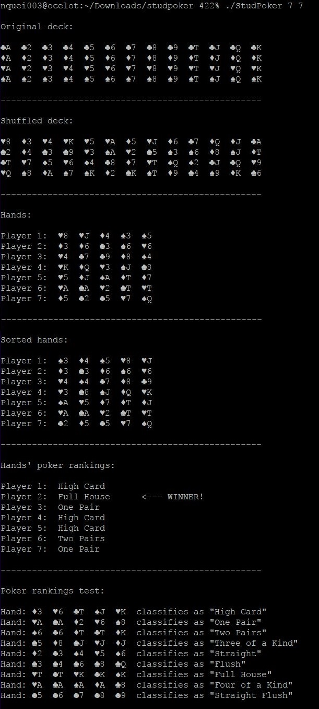

# Stud-Poker
Simulates a game of stud poker

## Objective:
Write algorithms and programs to implement a simulation of a deck of cards for a card game (following assignment 3 specs, except as noted below) - stud poker. Your simulation will use structures to represent each card, not a simple primitive type — your choice on how to represent the deck and hands; but hands should be separate from the deck. This implementation will only allow from 1-7 players (instead of 1-13) and ONLY 5 cards per hand (instead of 1-13) — but use the same command-line interface from assignment 3. During your validation, any integer value entered for the cards per hand may be changed to 5.

Your simulation will perform all the tasks of assignment 3. Additionally, the hands will be sorted (by face value) and displayed after sorting. The hands will then be assigned their poker rank (one pair, two pair, flush, etc.). Finally, one (or more) of the hands will be designated as “the winner”, based upon hand ranking.

## Input:
Accept input via the command-line arguments. Validate command-line input. Input will be the number of cards/hand and the number of hands (players), in that order.

## Output:
Display the original deck, display the shuffled deck, and display each of the hands of cards. Then, display the sorted hands, labeling each hand with its poker rank. Decks, hands and cards should be clean, clear and appropriately labeled - do not simply list as a simple column or row of values. Next, display a list of winner(s), or clearly designate the winner(s) when you display the labeled hands.

After the game is concluded, have your program execute a “test function” that passes a collection of pre-set poker hands, one to each poker-ranking function, in order to validate that each poker-ranking function correctly ranks such a hand. Display each of the pre-set hands and the results of the tests.

